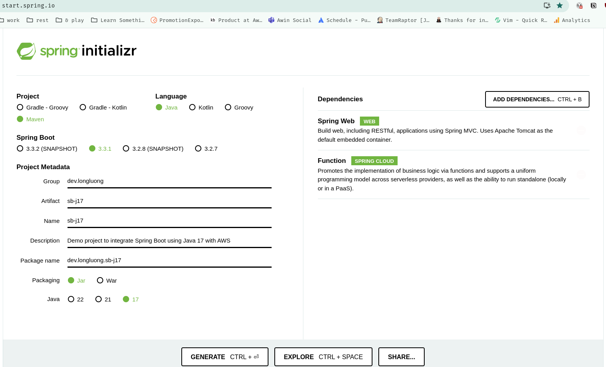

# Simple AWS Lambda Handler written in Java 17 using Spring Boot Framework

When activivated by the Lambda function.  It will reverse the given string.

## Build

### Generate the Spring Boot Framework skeleton code

`mvn clean package`

This will out put the file: `target/sb-j17-0.0.1-SNAPSHOT-aws.jar`

Create a Java 17 Lambda function and upload this JAR file, then set the `Handler` to `org.springframework.cloud.function.adapter.aws.FunctionInvoker::handleRequest
` in the `Runtime Settings` section.

## Test

Specify a string in the `Event Json` section of the `Test` tab of the  lambda function, and press `Test`.

You should see the given string reversed.
